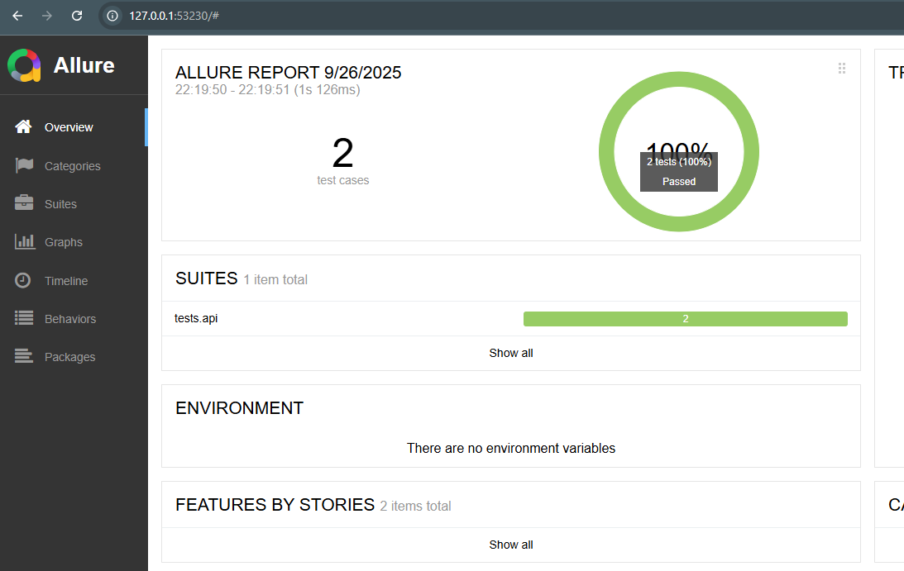
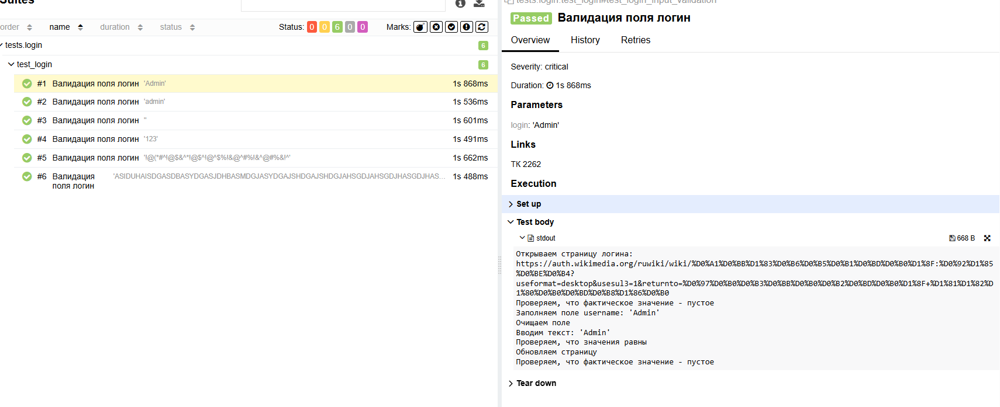

# 🚀 DemoPythonAT

**DemoPythonAT** — это демонстрационный проект для автоматизации тестирования веб-приложений с использованием Python.

---

## 🧰 Стек технологий

- **Python 3** — основной язык написания тестов.
- **Pytest** — фреймворк для запуска и организации тестов.
- **Selenium WebDriver** — управление браузером для выполнения UI-тестов.
- **ChromeDriver** — драйвер для взаимодействия с браузером Google Chrome.

---

## 🗂 Структура проекта

**pages** — Страницы (паттерн Page Object)<br>
**src** — Ресурсы:
- **screenshots** — Папка для сохранения скриншотов
- **test_data** — Тестовые данные (логины, пароли и т.д.)
- **utils** — Вспомогательные утилиты (ассерты, функции календаря, методы выгрузки тестовых данных)

<br>**tests** — Тесты:
- **login** — Тесты связанные с логином и авторизацией пользователей
- **api** — API тесты

---

## Запуск тестов

**Из командной строки с выбором тестов:**<br>
```pytest -m <метка> -v```<br>
Например: ```pytest -m positive -v```<br>
**Из командной строки сразу ВСЕ тесты:**<br>
```pytest -v```<br>

**Генерация отчетов:**<br>
```allure serve allure-results```<br>
**Пример того, как выглядит отчет после генерации:**<br>

